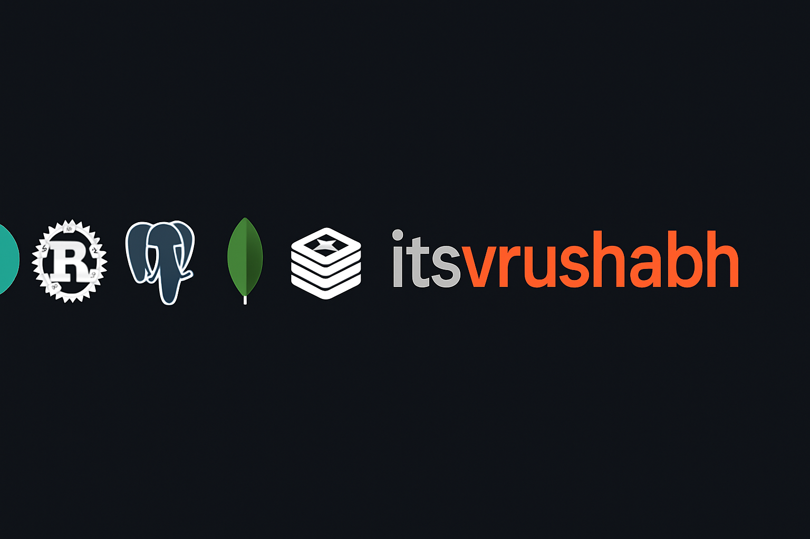

  

  # 👋 Hey, I'm Vrushabh

  **Backend Developer | API Designer | Rust Enthusiast**

  I’m passionate about building scalable, fast, and reliable backend systems. Whether it’s designing clean REST APIs, optimizing databases, or deploying services with Docker — I enjoy working across the stack to deliver solid backend solutions.

  
  

 

- 🔧 Working with **Rust**, **Python**, **PostgreSQL**, **MongoDB**, and **Redis**
- 🌱 Currently learning: Advanced Rust and distributed systems design
- 🧪 Obsessed with performance, clean code, and system architecture

---

  <h2>⚙️ Tech Stack</h2>

  <h3>Languages & Frameworks</h3>
  
  
  
  

  <h3>Databases & Infrastructure</h3>
  
  
  
  

  <h3>Tools</h3>
  
  
  

---

## 🚀 Projects

- [🧰 **FastAPI Template**](https://github.com/itsvrushabh/fastapi-template) – Production-ready FastAPI template with Docker, PostgreSQL, and Redis
- [☁️ **Ente Local**](https://github.com/itsvrushabh/ente_local_without_s3) – End-to-end encrypted cloud storage setup without S3 dependency
- [💰 **FTracker**](https://github.com/itsvrushabh/FTracker) – Finance and budget tracking application

---

 

> ⚡ Fun Fact: I love building backend systems that *just work* — fast, fault-tolerant, and future-proof.
